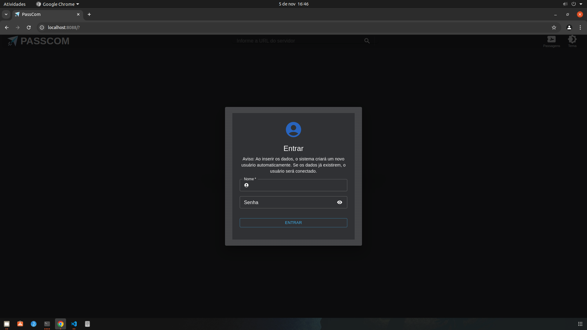
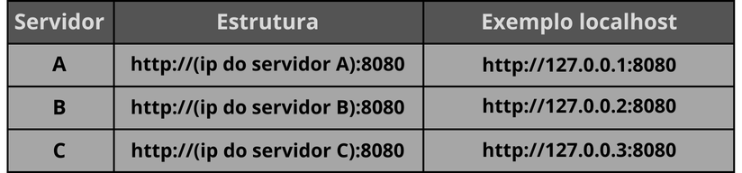
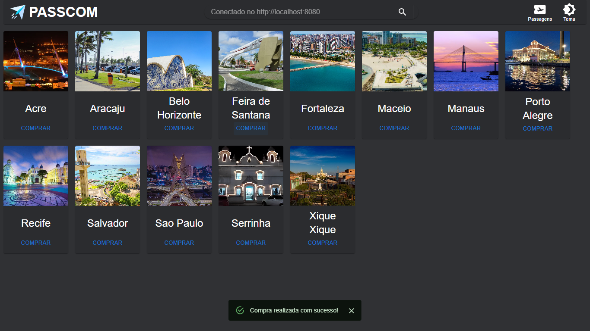
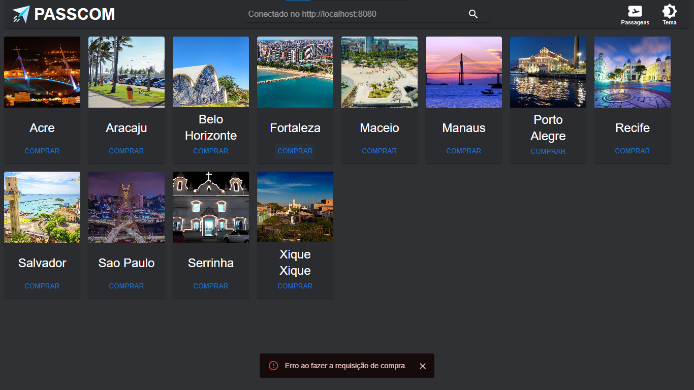
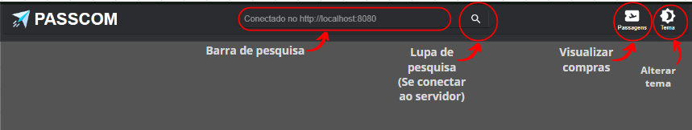
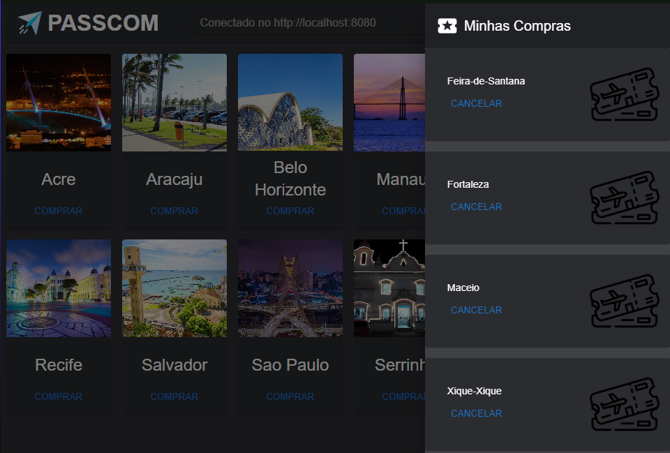
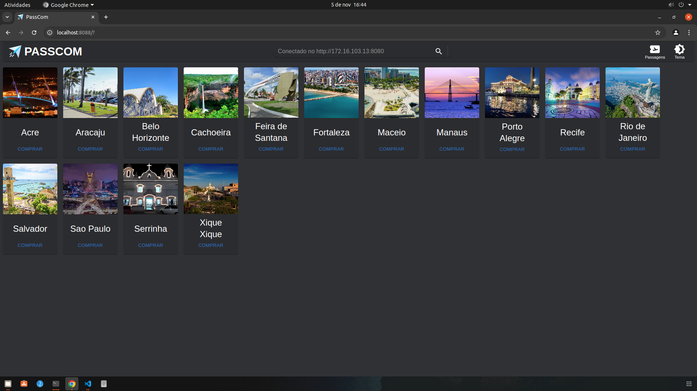
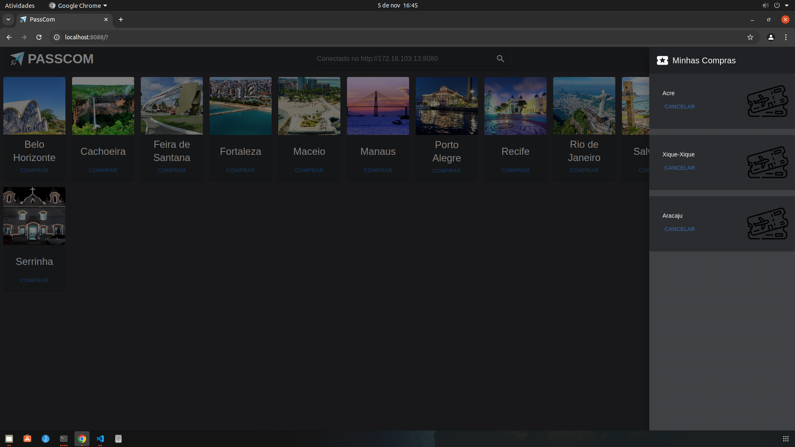
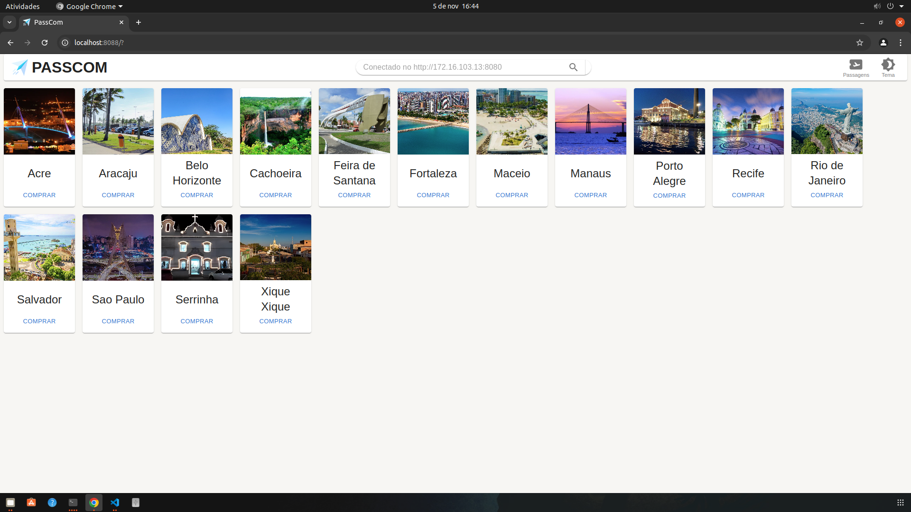
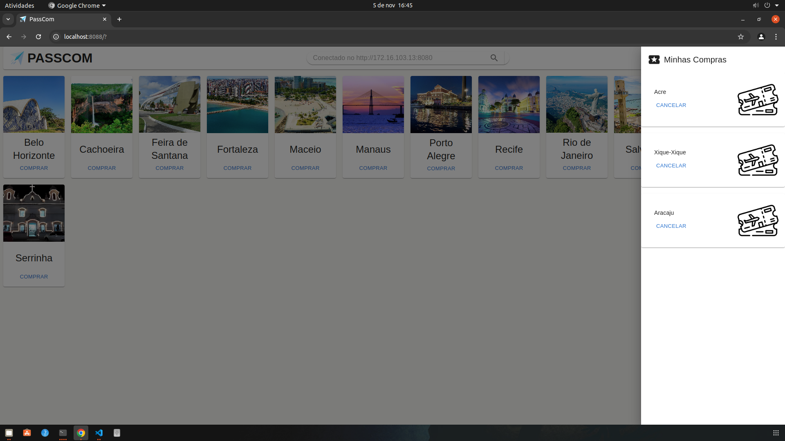

<h1 align="center">PASSCOM: Venda Compartilhada de Passagens</h1>
<h3 align="center">
    Este projeto foi desenvolvido como parte do segundo problema da disciplina MI - Concorrência e Conectividade do curso de graduação em Engenharia de Computação na UEFS
</h3>

    <h2>Sobre o projeto</h2>
    

        O projeto desenvolvido consiste em um sistema de compra de passagens aéreas para diversas localidades, incluindo a opção de cancelamento das compras, funcionando sobre o modelo de sistemas distribuídos, tendo em sua formação a presença de 3 servidores. O sistema é composto por dois principais componentes: os clientes, responsáveis por solicitar a compra e obter informações sobre as passagens, e os servidores, que realizam o processamento e o armazenamento das passagens adquiridas em suas estruturas de dados, bem como a vinculação dessas passagens aos respectivos compradores. Tanto o cliente quanto os servidores foram desenvolvidos na linguagem de programação Go, recomendada por sua eficiência em projetos que envolvem comunicação em redes e tratamento adequado de concorrência. Para uma comunicação baseada em arquitetura REST com a linguagem Go, foi utilizado o <em>framework</em> Gin, que facilita a criação de rotas e a comunicação entre os componentes do sistema.
    

<h2>Equipe: </h2>

<ul>
    <li><a href="https://github.com/avcsilva">Antonio Vitor Costa da Silva</a></li>
    <li><a href="https://github.com/SivalLeao">Sival Leão de Jesus</a></li>
</ul>

<h1 align="center">Sumário</h1>

    <ul>
        <li><a href="#arquitetura">Arquitetura do sistema</a></li>
        <li><a href="#comunicacao">Protocolo de comunicação</a></li>
        <li><a href="#concorrência">Concorrência distribuída</a></li>
        <li><a href="#frontend">Interface do usuário</a></li>
        <li><a href="#resultados">Resultados</a></li>
        <li><a href="#execucao">Execução do Projeto</a></li>
        <li><a href="#conclusao">Conclusão</a></li>
    </ul>

    <h2>Arquitetura do sistema</h2>
    

        

            O sistema utiliza uma arquitetura distribuída RESTful baseada em três servidores independentes, cada um representando uma companhia aérea diferente, possuindo seus próprios conjuntos de passagens. A arquitetura garante a disponibilidade e tolerância a falhas, uma vez que a operação do sistema é mantida mesmo com a falha de um dos servidores.
        

        

            Todos os dados recorrentes de processamento das passagens são atribuídos aos servidores, assim, as informações referentes aos clientes permanecerão salvas e seguras quando o mesmo se desconectar e desejar retornar futuramente.
        

        <h3>Servidor</h3>
        

            Os servidores são responsáveis pelo processamento e armazenamento de todas as informações referentes ao funcionamento do sistema. Sendo elas, as rotas de voo dispostas em suas estruturas de dados e suas disponibilidades para compra, tal como os clientes cadastrados e suas respectivas compras. 
        

        

            Os clientes são cadastrados automaticamente com seus nomes de usuário assim que realizam seu primeiro acesso, o sistema armazenará seus dados de compra e permite cancelar voos já comprados. As informações de cadastro dos clientes são enviadas a todos os servidores ligados, permitindo que todos tenham conhecimento das compras realizadas e clientes existentes. Dessa forma, um usuário cliente pode acessar seus dados de compra pela conexão com qualquer um dos três servidores, necessitando apenas informar o mesmo nome de usuário inserido inicialmente.
        

        

            Os voos podem ser comprados por qualquer cliente desde que o voo esteja disponível, ou seja, que nenhum outro cliente tenha a posse.
        

        

            As ações do servidor incluem:
        

        <ol>  
            <li>
                O servidor exibe no terminal um log de debugs, próprio do <em>framework</em> Gin utilizado, mostrando as requisições recebidas e respondidas, bem como os erros que possam ocorrer.
            </li>
            <li>
                Realizar cadastro e reidentificação de clientes, permitindo que os mesmos possam acessar suas compras em qualquer servidor.
                <ol type="a">
                    <li>
                    Em caso de cadastro, o registro será encaminhado aos outros servidores, para que todos possuam as informações de todos os clientes.
                    </li>
                </ol>
            </li>
            <li>
                Listar os clientes já previamente conectados e cadastrados, tais como os registrar a partir de ID’s, que lhes são atribuídos no momento de suas conexões.
            </li>
            <li>
                Concatenar as passagens de cada servidor em uma única estrutura de dados e enviar para o cliente a listagem de todas as localidades existentes, tal como suas disponibilidades para compra.
            </li>
            <li>
                Realizar a compra de passagens para os clientes, verificando se a passagem está disponível e, em caso positivo, realizando a operação e retornando uma mensagem de confirmação, caso contrário, retornar uma mensagem de erro.
                <ol type="a">
                    <li>
                        Caso a passagem seja comprada, o servidor deve atualizar a lista de passagens disponíveis, marcando a passagem como ocupada, tal como atualizar o registro dos clientes em cada servidor.
                    </li>
                </ol>
            </li>
            <li>
                Enviar para o cliente a listagem de suas passagens atualmente adquiridas.
                <ol type="a">
                    <li>
                        Caso o cliente não possua nenhuma aquisição, será devolvida uma mensagem indicando esse fato.
                    </li>
                </ol>
            </li>
            <li>
                Cancelar passagens para os clientes, verificando se a passagem existe e pertence ao cliente, e, em caso positivo, realizar a operação e retornar uma mensagem de confirmação, caso contrário, retornar uma mensagem de erro.
                <ol type="a">
                    <li>
                        Caso a passagem seja cancelada, o servidor deve atualizar a lista de passagens disponíveis, marcando a passagem como livre, tal como atualizar o registro dos clientes em cada servidor.
                    </li>
                </ol>
            </li>
        </ol>
        É utilizado o protocolo <em>stateful</em>, salvando as informações em variaveis no sistema dos servidores, porém é importante frisar que tais informações armazenadas estarão disponíveis apenas enquanto os servidores estiverem funcionando. No momento do desligamento de todos os servidores, todos os registros serão retornados a seus valores padrões.
        <h3>Cliente</h3>
        É a parte do sistema com o qual o usuário irá interagir para realizar suas solicitações, como comprar voos, ver voos comprados e até mesmo cancelá-los. É responsável por oferecer uma interface baseada em terminal para possibilitar que os usuários possam visualizar as informações e inserirem as ações que desejam realizar. Por meio dessa parte do sistema será possível:
        <ol>
            <li>
                Indicar com qual servidor se deseja conectar para interação, por meio de endereço IP e porta de conexão.
            </li>
            <li>
                Realizar o cadastro de um novo cliente ou reconectar ao sistema, informando seu nome de usuário.
            <li>
                Solicitar a lista de localidades disponíveis.
            </li>
            <li>
                Comprar passagens para as localidades disponíveis.
            </li>
            <li>
                Consultar a lista de passagens já adquiridas.
            </li>
            <li>
                Cancelar passagens já adquiridas.
            </li>
        </ol>
        O cliente utiliza o protocolo <em>stateless</em>, não possui nenhum armazenamento de dados e realiza processamento apenas para o envio e recebimento de mensagens, tal como processa a exibição da lista de passagens disponíveis, representando com cores quais estão liberadas para compra e quais estão atualmente ocupadas, respectivamente as cores verde e vermelho.
    

    <h2>Protocolo de comunicação</h2>
    

    

        Toda a comunicação do sistema foi projetada sobre o modelo RESTful, utilizando requisições HTTP entre servidores e clientes. Por ser uma comunicação baseada em HTTP, o sistema não exige uma conexão previamente estabelecida e é inerentemente stateless, ou seja, o estado da interação não é mantido entre as requisições. A cada solicitação, o cliente envia os dados necessários para a operação, e a resposta é processada com base na situação atual dos servidores. Essa abordagem elimina a dependência de sessões persistentes, oferecendo maior escalabilidade e resiliência, pois o sistema continua funcional mesmo que um dos servidores deixe de responder temporariamente.
    

    

        O sistema desenvolvido tem como proposto o seguinte protocolo de comunicação, iniciando-se a partir do momento em que o usuário insere seu nome de usuário para se conectar ao servidor:
    

        <ol>
            <li>
                O cliente realiza uma requisição POST para a rota "/cadastro" do servidor selecionado, enviando um JSON serializado contendo o nome de usuário inserido.
            </li>
            <li>
                O servidor recebe a requisição, desserializa o JSON e verifica se o nome de usuário já está cadastrado. Caso não esteja, o servidor registra o novo cliente em si e nos outros servidores. Em seguida, tanto para o caso de já cadastrado quanto de não cadastrado, responde com um JSON contendo o ID do cliente, que será utilizado para identificar o usuário nas próximas requisições.
            </li>
            <li>
                O cliente verifica a resposta do servidor, validando o ID recebido. Caso ocorra algum tipo de erro, a execução do cliente repete o processo de cadastro, exigindo nome de usuário e tentando novamente a requisição de cadastro. Caso contrário, o cliente exibe o menu principal, permitindo que o usuário realize as operações desejadas.
            </li>
        </ol>
    

    

        Após a realização dessa comunicação inicial, o cliente terá conhecimento de seu ID atribuído e os servidores já terão em seus registros a presença do novo cliente. A partir desse ponto, o cliente poderá realizar as operações de compra e consulta de passagens, seguindo o protocolo de comunicação a seguir, explicitando-se cada uma de sua possíveis ações:
        <ol>
            <li>
                O cliente envia uma requisição GET para a rota "/rotas" do servidor, solicitando a lista de todas as localidades disponíveis, tal como suas disponibilidades
                <ol type="a">
                    <li>
                        O servidor que recebeu a requisição realiza a mesma requisição para os outros servidores (porém com a adição de um cabeçalho "X-Source" contendo o termo "servidor"), montando uma estrutura de dados que concatene todas as passagens presentes nos registros de cada um dos servidores. Em seguida, responde ao cliente com um JSON contendo a lista de todas as localidades reunidas e suas disponibilidades.
                        <ol type="i">
                            <li>
                                Os servidores que recebem a requisição com o cabeçalho "X-Source" não realizam a requisição para os outros servidores, apenas respondem com a lista de localidades e disponibilidades que possuem em seus registros.
                            </li>
                        </ol>
                    </li>
                </ol>
            </li>
            <li>
                O cliente envia uma requisição GET para a rota "/rotas_cliente", incluindo um parâmetro de <em>query</em> com o ID do cliente, solicitando a lista de todas as passagens adquiridas pelo cliente
                <ol type="a">
                    <li>
                        O servidor valida a mensagem recebida e, caso o ID do cliente seja válido, responde com um JSON contendo a lista de todas as passagens adquiridas pelo cliente. Porém, em caso de algum problema (como um ID inválido ou a não presença de passagens atribuídas àquele cliente), o servidor responderá com uma mensagem de erro indicando o ocorrido.
                    </li>
                </ol>
            </li>
            <li>
                O cliente envia uma requisição PATCH para a rota "/comprar_rota" do servidor, enviando um JSON serializado contendo o ID do cliente e o nome da localidade que deseja comprar
                <ol type="a">
                    <li>
                        O servidor que recebe a requisição valida o JSON recebido e verifica se a localidade desejada está disponível para compra (reunindo todas as passagens e disponibilidades de todos os servidores, tal como ocorre na requisição GET para "/rotas"). Caso esteja, realiza a operação de compra atualizando os registros de passagens e clientes em sua memória e na dos outros servidores (também utilizando a rota "/comprar_rota") e responde com um JSON contendo uma mensagem de confirmação. Caso contrário, responde com uma mensagem de erro indicando o ocorrido.
                        <ol type="i">
                            <li>
                                No início da validação da requisição, é analisado se há um cabeçalho "X-Source" na requisição, indicando que a requisição foi feita por um servidor. Caso haja, o servidor que recebeu a requisição não realiza a requisição para os outros servidores, apenas responde com a confirmação ou erro da operação.
                            </li>
                        </ol>
                    </li>
                </ol>
            </li>
            <li>
                O cliente envia uma requisição PATCH para a rota "/cancelar_rota" do servidor, enviando um JSON serializado contendo o ID do cliente e o nome da localidade que deseja cancelar a compra
                <ol type="a">
                    <li>
                        O servidor que recebe a requisição valida o JSON recebido e verifica se a localidade desejada está atribuída ao cliente. Caso esteja, realiza a operação de cancelamento atualizando os registros de passagens e clientes em sua memória e na dos outros servidores (também utilizando a rota "/cancelar_rota") e responde com um JSON contendo uma mensagem de confirmação. Caso contrário, responde com uma mensagem de erro indicando o ocorrido.
                        <ol type="i">
                            <li>
                                No início da validação da requisição, é analisado se há um cabeçalho "X-Source" na requisição, indicando que a requisição foi feita por um servidor. Caso haja, o servidor que recebeu a requisição não realiza a requisição para os outros servidores, apenas responde com a confirmação ou erro da operação.
                            </li>
                        </ol>
                    </li>
                </ol>
            </li>
        </ol>
        </li>
    

    <h2>Concorrência Distribuída</h2>
    

        

            Por utilizar do <em>framework</em> Gin, o sistema usufrui de funcionalidades tal como a de concorrência, que permite que múltiplas requisições sejam processadas simultaneamente, garantindo que o sistema possa lidar com diversos usuários conectados e requisições ao mesmo tempo. A concorrência é uma característica essencial para sistemas distribuídos, uma vez que a comunicação entre os componentes do sistema ocorre de forma assíncrona e não sequencial, permitindo que o servidor possa atender a múltiplas requisições de clientes simultaneamente.
        

        

            Entretanto, fora as funcionalidades do Gin, não há, neste projeto, qualquer outro método para o tratamento de concorrência distribuída para casos de acessos a funções críticas entre os servidores. O sistema foi projetado para que cada servidor possua uma cópia dos registros de clientes e passagens, e que cada servidor possa atualizar os registros dos outros servidores quando necessário.
        

    

    <h2>Interface do usuário</h2>
    

        

            Para a criação do frontend, foi utilizado <a href="https://react.dev">React</a> com JavaScript para construir a interface do usuário, enquanto as requisições HTTP foram implementadas com a biblioteca <a href="https://www.npmjs.com/package/axios"> Axios</a>, permitindo uma comunicação eficiente com o backend. Além disso, foi adotado o <a href="https://mui.com/material-ui/">Material UI</a> para estilizar componentes e manter uma aparência consistente e moderna, facilitando o desenvolvimento e garantindo uma experiência de usuário responsiva e visualmente agradável.
        

        <h3>Terminal</h3>
        <h4>Executar</h4>
        

            Para executar o código do frontend via Docker, siga os passos abaixo:
        

        <ol>
        <li>Navegue até o diretório da aplicação no seu terminal.</li>
        <li>Digite o comando abaixo no terminal para criar a imagem Docker e executar a aplicação automaticamente:
            <pre><code>docker compose up --build</code></pre>
        </li>
        <li>Quando a execução estiver concluída, o terminal exibirá a URL onde a aplicação está disponível:
            <code>http://localhost:8088</code>
        </li>
        <li>Para abrir a aplicação diretamente no navegador, pressione a tecla <code>Ctrl</code> enquanto clica com o botão direito do mouse sobre o link no terminal.</li>
    </ol>
    

    <h3>Interface</h3>
    <h4>Tela de Cadastro/Login</h4>
    

    Ao abrir a aplicação no navegador, o usuário verá uma solicitação de cadastro/login.
    

    <h5>
        Funcionamento:
    </h5>
    <ul>
        <li>
            Se os dados do usuário não estiverem registrados no servidor, um novo cadastro será realizado, e o usuário receberá um identificador único (ID).
            </li>
        <li>
            Se os dados do usuário já existirem no servidor, o sistema reconhecerá o usuário e retornará seus dados, permitindo o acesso aos recursos da aplicação.
            </li>
    </ul>
    

      
    

    
<strong>Tela Cadastro/Login</strong>

    <h5>Conectando ao servidor</h5>
    
Ao registrar-se, o servidor ainda não exibirá as rotas disponíveis. O usuário deve informar a URL do servidor desejado na barra de pesquisa e, em seguida, clicar no ícone de lupa para se conectar. Se o usuário pressionar a tecla Enter enquanto estiver na barra de pesquisa, o sistema retornará à página de cadastro/login. A URL deve seguir o formato padrão:

    

      
    

    
<strong>Formato da URL</strong>

    

    Na barra de pesquisa, o sistema informará se o usuário está conectado ao servidor ou se ocorreu algum erro. Em caso de erro, existem dois possíveis motivos: o servidor está off-line ou a URL está incorreta, mas o sistema não faz a distinção entre esses casos. Quando conectado ao servidor, pode haver um pequeno atraso na exibição das rotas. É importante observar que, mesmo estando conectado ao Servidor A, o usuário poderá receber dados dos Servidores B e C, desde que estes estejam ativos. Os cadastros realizados são independentes do servidor ao qual o usuário está conectado, pois todos os servidores armazenam os dados. Somente se os três servidores estiverem off-line simultaneamente, os dados serão perdidos.
    

    

      
    

    
<strong>Tela Principal - Rotas disponíveis para compra</strong>

    <h5>Comprar</h5>
    

Para realizar uma compra, basta clicar no botão "COMPRAR" abaixo do nome da rota desejada. As rotas exibidas são as disponíveis para compra, com algumas exceções. A interface é atualizada periodicamente, portanto pode haver momentos em que a rota já foi comprada, mas a interface ainda não refletiu essa alteração. Nesse caso, uma mensagem indicará que a compra não foi possível, e a rota desaparecerá da lista em breve.

Se a compra for bem-sucedida, a interface exibirá uma confirmação. Caso ocorra um erro na compra, ele pode ter duas causas: outro usuário comprou a rota antes da atualização da sua interface ou o servidor ao qual você está conectado ficou off-line. O sistema não diferencia entre esses motivos.

      
    

    
<strong>Compra realizada com sucesso!</strong>

    

      
    

    
<strong>Erro ao fazer requisição de comprar</strong>

Recomenda-se aguardar alguns segundos; se a rota não desaparecer, é provável que o servidor tenha ficado off-line. Nesse caso, conecte-se a outro servidor inserindo a URL na barra de pesquisa e clicando na lupa, sem necessidade de realizar novo login. A troca de servidor pode ser feita a qualquer momento.

<h5>Visualizar suas compras</h5>

Para visualizar suas compras, clique no botão "Passagens" na barra de navegação (NavBar). Isso abrirá um menu lateral exibindo todas as passagens adquiridas. Para cancelar uma passagem, basta clicar no botão "CANCELAR"; a passagem será removida da lista e reaparecerá na tela principal como disponível para venda.

      
    

    
<strong>Funçoes da NavBar</strong>

    

      
    

    
<strong>Passagens compradas</strong>

    <h5>Outras funcionalidades</h5>
    
O código é responsivo e se adapta a diferentes tamanhos de tela, permitindo sua execução em qualquer dispositivo. Ele também oferece a opção de troca de tema, com modos claro e escuro, proporcionando uma melhor experiência para diversos perfis de usuários.

    

      
    

    
<strong>Tema escuro - Tela principal</strong>

    

      
    

    
<strong>Tema escuro - Menu lateral</strong>

    

      
    

    
<strong>Tema claro - Tela principal</strong>

    

      
    

    
<strong>Tema claro - Menu lateral</strong>

    <h2>Resultados</h2>
    

        

            Tendo sido testado em laboratório com uso de diversos computadores para simular a conexão simultânea de múltiplos clientes, foi possível averiguar que o sistema consegue lidar corretamente e de forma eficiente com as diversas requisições ocorrendo simultaneamente, não apresentando nenhum tipo de atraso ou travamento. Além disso, foi possível comprovar que cada servidor foi capaz de reconhecer corretamente cada cliente a partir de seu nome de usuário, sendo possível a recuperação dos dados e compras de cada usuário em qualquer um dos servidores.
        

        

            Da maneira como projeto foi concebido, um cliente que tenha sua conexão perdida não consegue reconhecer o erro relatado em tempo real, mantendo a execução do programa na etapa em que parou, até que se tente enviar alguma requisição. Somente após a tentativa de enviar algo, o programa reconhece a perda da conexão e exibe uma mensagem de erro, solicitando em seguida um endereço alvo para realizar uma nova conexão. Caso o cliente receba de volta sua conexão com a rede, como tendo seu cabo de rede posto de volta, após o servidor ter encerrado sua conexão, esta não será iniciada novamente de forma automática. O usuário do cliente deverá indicar novamente o endereço alvo para poder se reconectar ao servidor e recuperar seus dados.
        

        

            Uma considerável porção do código fonte do projeto possui documentação sobre suas operações, indicando o que cada parte ou linha de código deve estar realizando para o funcionamento do sistema.
        

    

    <h2>Execução do Projeto</h3>
    

    <h3>Abrir o Terminal</h3>
    

        Este projeto deve ser executado no terminal do sistema operacional ou em IDEs Ambientes de Desenvolvimento Integrado (Integrated Development Environments).
    

    

    Para abrir o terminal: 
    <li>
        No Windows, pressione as teclas <code>Windows + R</code>, digite cmd na janela que abrir e confirme.
    </li>
    <li>
        No Linux, pressione as teclas <code>Ctrl + Alt + T</code> para abrir o terminal. 
    </li>
    Com o terminal aberto, navegue até o diretório onde os arquivos foram baixados utilizando o comando <code>cd</code>, por exemplo,
    

    
 
    <code>cd C:\PASSCOM-Venda-Compartilhada-de-Passagens\Server</code>
    

    <h3>Sem docker</h3>
    

        Para executar o projeto sem Docker, primeiramente, é necessário configurar o ambiente de trabalho instalando a linguagem de programação <a href="https://go.dev/doc/install">Go</a>. Em seguida, faça o download dos arquivos disponibilizados neste repositório.
    

    

        Deve ser aberto um terminal para cada código, e cada um possui um diretório diferente.
    

    

        O primeiro arquivo a ser executado deve ser o servidor. Embora o cliente possa ser iniciado primeiro, o servidor é quem informa o endereço da conexão.
    

    
 
    Para iniciar o servidor, insira o seguinte comando no terminal:

<code>go run servidor.go</code>
Ao iniciar a execução, será exigida uma entrada, que será qual dos três servidores deseja iniciar. Após isso, o servidor estará funcionando e exibirá o log de debugs do Gin. Com isso, não será mais possível interagir diretamente com o servidor, apenas visualizar suas saídas.

<h3>Cliente</h3>

Para iniciar o cliente, insira o comando no terminal:

<code>go run cliente.go</code>
Ao iniciar a execução, será solicitado que insira o endereço da conexão, seguindo-se para as etapas de cadastro e uso normal do sistema, tal como explicitado nos tópicos anteriores.

O menu do cliente será exibido, permitindo que o usuário interaja com o sistema utilizando os números do teclado para selecionar as opções desejadas.

    <h3>Com Docker</h3>
    

        Para executar o projeto, com Docker é necessário ter o docker instalado na sua máquina, em seguida baixar os arquivos dispostos neste repositório.
    

    <h3>Servidor</h3>
    

        Para utilizar os arquivos em contêiner é necessário primeiro criar a imagem docker.

Utilize o comando para gerar a imagem:

<code>docker build -t server .</code>
Para executar a imagem, roda a aplicação em container, utilize:

<code>docker run -it -p 8088:8088 server</code>
O código será executado e exibirá o endereço e porta, similar ao funcionamento sem docker, e os mesmo procedimentos deverão ser seguido

    <h3>Cliente</h3>
    

        Para iniciar o cliente, crie a imagem utilizando o comando a seguir:

<code>docker build -t client .</code>
Para executar a imagem:

<code>docker run -it --rm client</code>
Logo após, será solicitado que você insira o endereço da conexão exatamente como foi informado pelo servidor, incluindo todos os pontos separadores.

O menu do cliente será exibido, permitindo que o usuário interaja com o sistema utilizando os números do teclado para selecionar as opções desejadas.

    <h3>Comprar/Cancelar Compra</h3>
    

        Na tela que apresenta os nomes das cidades disponíveis para compra ou cancelamento de passagens, é importante que o nome da cidade seja digitado exatamente como está exibido, respeitando letras maiusculas e/ou minúsculas e eventuais assentos.
    

    <h2>Conclusão</h2>
    

        

            De acordo com os resultados obtidos em testes em laboratório, é possível afirmar que o produto cumpre com o que se propõe inicialmente. Com a execução correta do servidor e do cliente, é possível realizar e cancelar compras de passagens mesmo que haja a presença de diversos usuários simultâneos, com o servidor encarregado de realizar todo o processamento, todos os servidores tendo seus registros atualizados após cada requisição e tratamento local de concorrência para o caso de requisições coincidentes de múltiplos usuários.
        

        

            Ainda é possível aprimorar o sistema, como implementando uma metodologia para tratamento de concorrência distribuída para o sistema como um todo. Porém, o projeto ainda consegue lidar adequadamente com suas outras propostas, sendo assim bem favorável para a sua utilização.
        

    

